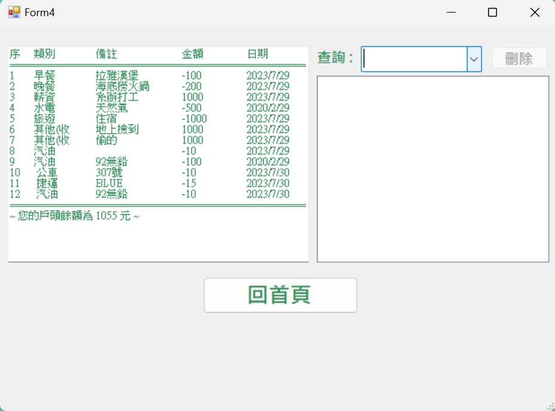

# Simple-Accountbook 
Description :  The account book written in C sharp 
## Download:
1. Click below ! 
https://github.com/chs415009/simple-accountbook.git  

2. Use Visual Studio to operate it by executing "AccoutingAPP.sln" file. 

## Instructions:
__This project allows you to record all your expense and income with several functions.__  
~ The detailed procedure is shown below. ~  
 

### --- Form 1 ----------
* __The first form is for sign in/ sign up.__

__1.__  

* The initial input of the username and password serves as the registration process. The system will check if this account exists. 
If it doesn't, a prompt will appear asking whether to proceed with registration. 
 

__2.__  

  
  
  
  

* As for the four above images, the system will automatically if there are blanks or incorrect password.  
 

### --- Form 2 ----------
* __The second form is the main page.__  
From left to right, the three buttons are: 離開-Exit, 新增-Add, 檢視-View.

__1.__  

* The "離開" button is for save and exit. When you click it, it will confirm agian.   
* The "新增" and "檢視" buttons will take you to "Form3" and "Form4" respectively.  
(Form3 and Form4 are explained below) 
 

__2.__  

  
   

* If click true, it will successfully save and quit.  
* If click false, it won't save and quit. Instead, it will show all the records for you to check. 
 

### --- Form 3 ----------
* __The third form is for adding new records.__

__1.__  

* First, you can select the date at the top of the page. 
** _You will need to select from year to day squentially to correctly show 29th, 30th, 31th.  
Otherwise, it may have errors on the date_. ** 
 

__2.__  

* After you successfully add a new record, the message box will show the result. 
 

__3.__  

* As follows, the second message box will appear after the first one.  
It shows all the records added that happened before leaving Form3. 
 

__4.__  

* As to the above image, if the category of the record is belong to "income" and the money is negative,  
  it will show "金額輸入有誤!", which means wrong format for the money.
* However, if you input positive number while selecting categories beloning to "expense", it will atoumatically add "-". 
 

### --- Form 4 ----------
* __The fourth form is for viewing and deleting records.__

__1.__  

* The list on the left side refers to all the records with information, including category, description, money and date. 
 

__2.__  

  
  

  
* The records on the right side can be filtered by the category you selected in "查詢" textbox.  
  "-" Represents the level of each group of categories  
  ( Ex: Selecting "交通" will show the results ,including "汽油", "公車", "火車", "捷運", "其他(交" ) 
 

__3.__  

  
    

* If you want to delete a record, you will have to select it on the right side and then click "刪除" button.  
  ** _You can only delete one record at a time._ **
* If you click the button without selecting any records, it will notice you with a messgae box.  

## Let's begin !

