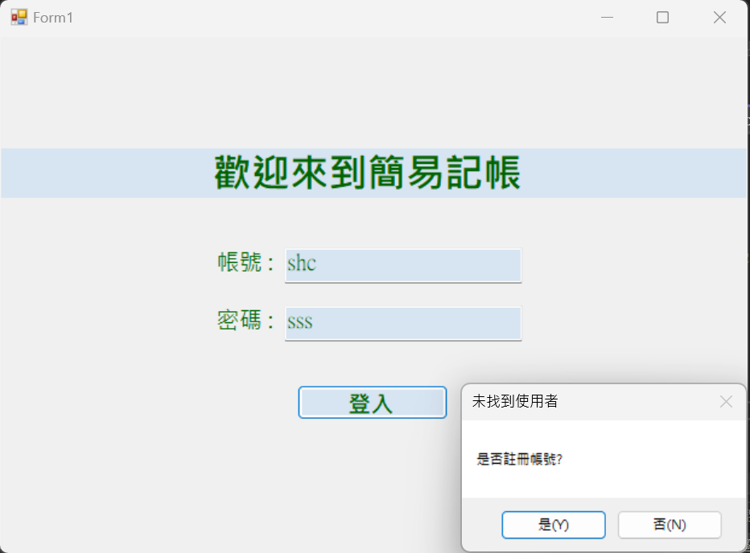
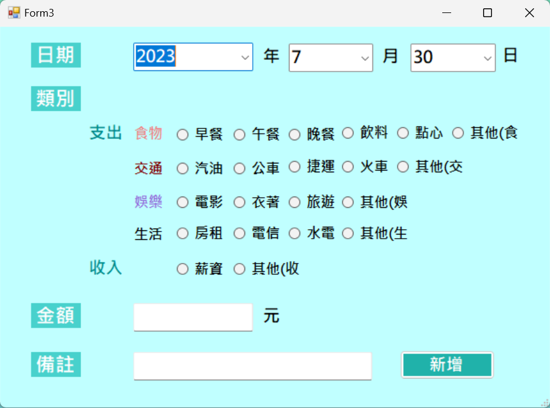

# Simple-Accountbook ( an account book written by C sharp )
## Download:
Click below ! 
https://github.com/chs415009/simple-accountbook.git

## Instructions:
__This project allows you to record all your expense and income with several functions.__  
~ The detailed procedure is shown below. ~
### Form 1
* __The first form is for sign in/ sign up.__

* The initial input of the username and password serves as the registration process. The system will check if this account exists. 
If it doesn't, a prompt will appear asking whether to proceed with registration.  
 
  

  
  
  
  

  

* As for the four above images, the system will automatically if there are blanks or incorrect password. 

### Form 2
* __The second form is the main page. __
From left to right, the three buttons are: 離開-Exit, 新增-Add, 檢視-View. 

 

* The "離開" button is for save and exit. When you click it, it will confirm agian.   
* The "新增" and "檢視" buttons will take you to "Form3" and "Form4" respectively.  
(Form3 and Form4 are explained below) 

 

* If click true, it will successfully save and quit.  
* If click false, it won't save and quit. Instead, it will show the changes from the previous login to now.
(pic)
 

### Form 3
* __The third form is for adding new records. __
 
1. 

* First, you can select the date at the top of the page. 
** _You will need to select from year to day squentially to correctly show 29th, 30th, 31th.  
Otherwise, it may have errors on the date_. **

 
2. 

* After you successfully add a new record, the message box will show the result.

 
3. 

* As follows, the second message box will appear after the first one.  
It shows all the records added that happened before leaving Form3.

 
4. 

* As to the above image, if the category of the record is belong to "income" and the money is negative,  
it will show "金額輸入錯誤", which means wrong format for the money.
* However, if you input positive number while selecting categories beloning to "expense", it will atoumatically add "-".

